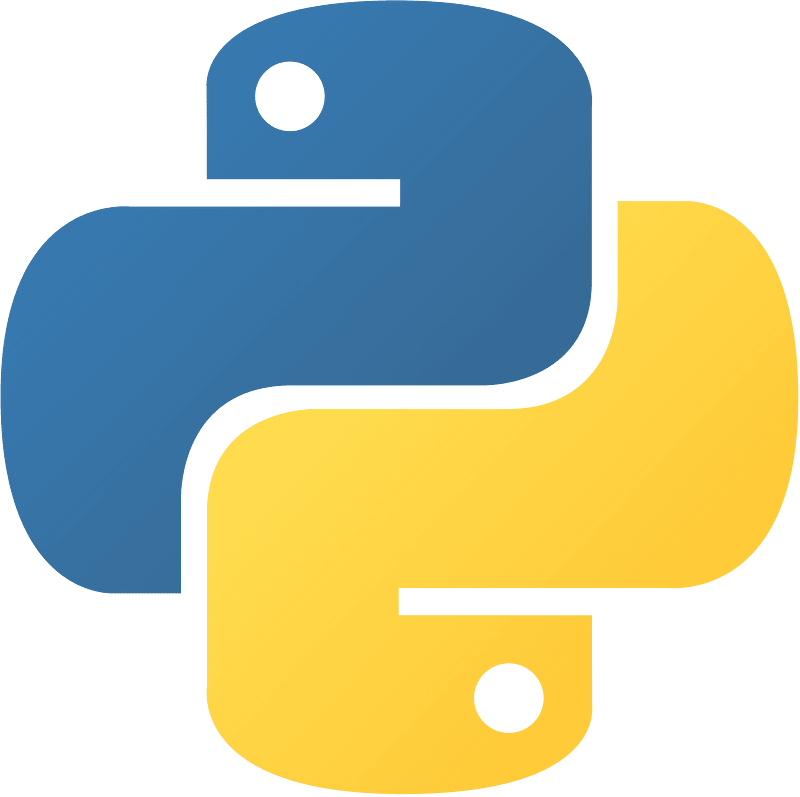
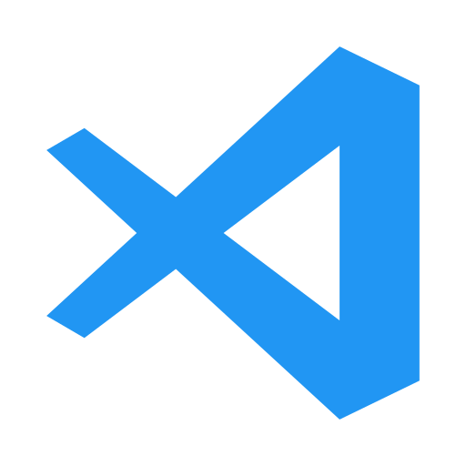
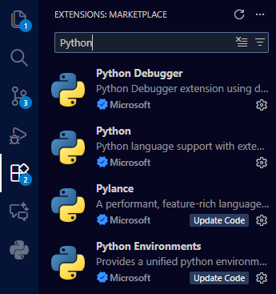

# Estudo Python
## Estuda da linguagem Python para aplicação dos conceitos de lógica da programação

<p align="center">

</p>

<p align="center">

</p>

### Utilização do Python
Para usar a linguagem de programação Python, será necessário
fazer a instalação da linguagem. Abaixo o link para o download:
<a href="https://python.org">Download Python</a>


### Utilização do Python no VSCode
Depois de instalado o Python, você deve instalar a extensão do python:
<p align="center">

</p>

#### Primeiro comando em Python
``` python

print(Hello, World)

```
